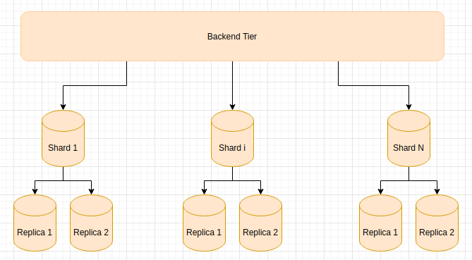
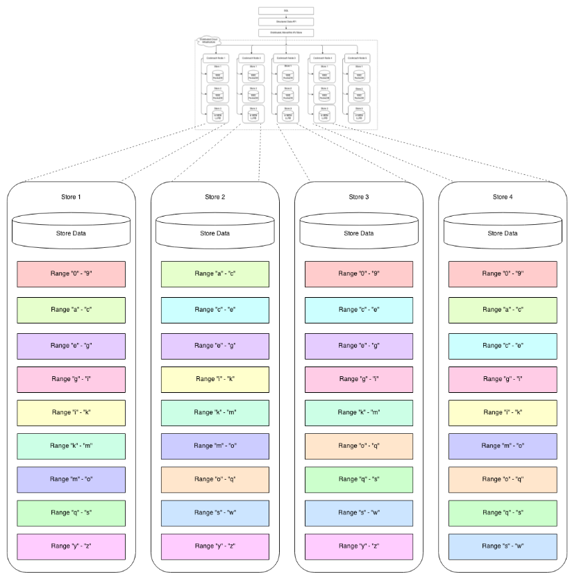

# Home-social-network

## Масштабируемая система диалогов

### Постановка задачи

Требуется реализовать систему чатов. 

* В каждом чате может быть произвольное количество участников.
* Участники обмениваются текстовыми сообщениями.
* Предположим, что средний размер сообщения 200 байт.
* Разные чаты имеет разную активность. Например, активность чата А может быть значительно выше активности чата B.
* При открытии чата, пользователь видит последние `n` сообщений. Это и является самым частым запросом на чтение.
* Ожидается высокая нагрузка как на запись, так и на чтение.
* Необходимо иметь возможность горизонтально масштабировать хранилище сообщений.

Приблизительная схема таблицы с сообщениями.
```sql
create table if not exists messages (
    chat_id      bigint,
    message_id   bigint,
    published_at timestamp,
    message      text,
    author_id    bigint
);
```

### Дизайн

Для масштабирования операции чтения будем использовать репликацию, для масштабирования операции записи - шардинг.



Рассмотрим варианты разбиения таблицы на шарды.

#### Подход 1

Оптимальным с точки зрения операции чтения будет выбор в качестве ключа шардирования `chat_id`. В таком случае все
сообщения будут расположены на одной машине и возврат последних `n` сообщений затронет лишь одну машину.
Однако в силу неравномерности распределения сообщений по чатам, некоторые шарды будут содержать большее количество
данных и должны будут обслуживать большее количество запросов.

#### Подход 2 (Scatter-Gather)

Оптимальным с точки зрения операции записи будет выбирать шард для записи случайным образом. В случае наличия хорошего
генератора случайных чисел, данные и операции записи будут равномерно распределены по шардам. Существенным недостатком
является необходимость чтения со всех шард. В таком случае задержка операции чтения будет всегда равна задержке самой 
медленной машине в кластере.

#### Подход 3 (модификация первого подхода)

В качестве ключа шардирования выберем композитный ключ `(char_id, message_id)`. `message_id` является уникальным 
идентификатором сообщения в чате, обладающее возможностью сортировки. Таким образом множество сообщений в чате будет
распределено по нескольким шардам, но при этом близкие по времени сообщения будут с высокой вероятностью хранится на
одной шарде.

Однако остается одно важное ограничение, количество операций записи в самый активный чат не должно приводить к
перегрузке шарда, так как все записи в один чат будут приходится на один шард.

### Выбор кластера

#### Vitess

* Поддерживает только `hash-based` шардинг по одной колонке. Это приводит к необходимости ввести дополнительную колонку
`shard_id`, которая содержит результат побитовой операции `(chat_id << 32) | bucket_id`, где `bucket_id` служит для 
группировки сообщений чата. Сообщения размещенные близко по времени в чате будут иметь один и тот же `bucket_id`.
`bucket_id` формируется на стороне приложения.
* Предоставляет средства для ручного решардинга почти без даунтайма (read-only операции доступны всегда и небольшой
даунтайм для write операций).
* Заявляется о возможность автофейловера в случае сбоя шарда.
* Построен вокруг mysql

#### Cassandra

* Только `hash-based` шардинг. Необходимо вводить колонку `bucket_id` как и в случае с `Vitess`.
* Больше усилий на обеспечение консистентности на стороне приложения.
* Эффективно на запись.

#### CockroachDB

* `range-based` шардинг. В качестве аналога шарда используется абстракция `range`
* Авторешардирование. Когда `range` достигает размера 64MB, `cockroach` автоматически разделяет его на два `range`.
* Репликация через `raft`
* Автофейловер, в случае сбоя `leader` ноды



### Реализация

В качестве хранилища используем `CockroachDB`. 

Запуск хранилища из 3 узлов
```
docker-compose up -d
docker exec -it node1 bash
cockroach sql --insecure
create database chat_db;
use chat_db;
```

Создадим таблицу и проверим начальное количество шард.
```
CREATE TABLE messages (
    chat_id         INT8 NOT NULL,
    message_id      INT8 NOT NULL,
    published_at    TIMESTAMPTZ NOT NULL,
    message         STRING NOT NULL,
    author_id       INT8 NOT NULL,
    CONSTRAINT "primary" PRIMARY KEY (chat_id ASC, message_id DESC),
    FAMILY "primary" (chat_id, message_id, published_at, message, author_id)
);
ALTER TABLE messages CONFIGURE ZONE USING num_replicas = 3;

show ranges from table messages;
  table_name | start_key | end_key | range_id | range_size_mb | lease_holder | lease_holder_locality | replicas | replica_localities
-------------+-----------+---------+----------+---------------+--------------+-----------------------+----------+---------------------
  messages   | NULL      | NULL    |       44 |             0 |            2 |                       | {1,2,3}  | {,,}
```

Видно, что на перед началом работы у нас один пустой range для таблицы `messages` (и 3 реплики). 

В ручную добавим несколько сообщений. В качестве `message_id` используем `snowflake`, так как он обеспечивает достаточные
гарантии уникальности, и дает возможность сортировать по времени.

```
insert into messages (chat_id, message_id, published_at, message, author_id) values (1, 1537200202186752, current_timestamp, 'Hello world!', 12);
insert into messages (chat_id, message_id, published_at, message, author_id) values (1, 1537200202186753, current_timestamp, 'Hi all', 13);
insert into messages (chat_id, message_id, published_at, message, author_id) values (1, 1537200202186755, current_timestamp, 'Welcome', 13);
select * from messages where chat_id = 50 order by message_id desc limit 5

  chat_id |     message_id      |         published_at          |       message        | author_id
----------+---------------------+-------------------------------+----------------------+------------
       1 | 1537200202186752 | 2021-12-11 10:00:17.992112+00 | Hello world! |   12
       1 | 1537200202186753 | 2021-12-11 10:00:17.991375+00 | Hi all |   13
       1 | 1537200202186755 | 2021-12-11 10:00:17.953486+00 | Welcome |   13
```

### Нагрузка и демонстрация решардинга

```
wrk -t10 -c10 -d60s --timeout 90s -s ./sharding/generator.lua --latency http://localhost:8088

...
Requests/sec:    114.05
Transfer/sec:    8.35KB
```

Как видно выводы неутешительны, при 10 параллельных клиентах RPS составляет всего 114.05.
Есть несколько причин, столь низких показателей:
1) Происходит random IO в разные шарды (которые расположены на одной машине), но на тестовой машине установлен HDD диск с низким Random Write IOPS.
2) Дополнительная синхронизация. Перед фиксацией сообщения происходит раунд raft репликации с другими узлами.

При отключении репликации и использовании одного узла, `cockroach` показывает сопоставимые с `Postgresql` результаты. В свою очередь отдельный экземпляр `MySql` им сильно уступает.

Посмотрим какое количество шард появилось после нагрузки (максимальный размер шарда был уменьшен до 1mb для демонстрации возможностей решардинга).

```
show ranges from table messages;

         start_key         |         end_key          | range_id | range_size_mb | lease_holder | lease_holder_locality | replicas | replica_localities
---------------------------+--------------------------+----------+---------------+--------------+-----------------------+----------+---------------------
  NULL                     | /13/-1729959032342446081 |       44 |      0.531163 |            2 |                       | {1,2,3}  | {,,}
  /13/-1729959032342446081 | /27/-1729959033047089153 |       58 |      0.514182 |            2 |                       | {1,2,3}  | {,,}
  /27/-1729959033047089153 | /50/-1729956507216248833 |       55 |      0.960941 |            2 |                       | {1,2,3}  | {,,}
  /50/-1729956507216248833 | /63/-1729958470486065157 |       54 |      0.521083 |            2 |                       | {1,2,3}  | {,,}
  /63/-1729958470486065157 | /76/-1729958574563524609 |       57 |      0.513664 |            2 |                       | {1,2,3}  | {,,}
  /76/-1729958574563524609 | /88/-1729959047576158211 |       56 |      0.516992 |            2 |                       | {1,2,3}  | {,,}
  /88/-1729959047576158211 | NULL                     |       59 |      0.558687 |            2 |                       | {1,2,3}  | {,,}
```

Видно, что решардинг работает корректно.

### Источники 

https://www.cockroachlabs.com/docs/stable/architecture/overview.html

* [Архитектура cockroach](https://www.cockroachlabs.com/docs/stable/architecture/overview.html)
* [How Discord Stores Billions of Messages](https://blog.discord.com/how-discord-stores-billions-of-messages-7fa6ec7ee4c7)
* [Schema Design for Social Inboxes in MongoDB](https://www.mongodb.com/blog/post/schema-design-for-social-inboxes-in-mongodb)