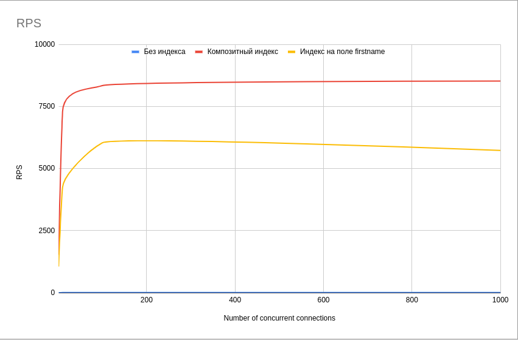

# Home-social-network

## Производительность индексов

### Предусловия

Используется один golang instance со следующими настройками пула соединений с БД.
```
DB_CONN_LIFE_TIME=3
DB_MAX_OPEN_CONNECTION=10
DB_MAX_IDLE_CONNECTION=10
```

### Поиск анкет по имени и фамилии без использования индекса

```mysql
select id, username, password, firstname, lastname, birthdate, gender, interests, city 
from profiles 
where (firstname like 'Ad%' and lastname like 'Kem%') 
order by id asc 
limit 100
```

План выполнения запроса
```
+----+-------------+----------+------------+------+---------------+------+---------+------+--------+----------+-------------+
| id | select_type | table    | partitions | type | possible_keys | key  | key_len | ref  | rows   | filtered | Extra       |
+----+-------------+----------+------------+------+---------------+------+---------+------+--------+----------+-------------+
|  1 | SIMPLE      | profiles | NULL       | ALL  | NULL          | NULL | NULL    | NULL | 955988 |     1.23 | Using where |
+----+-------------+----------+------------+------+---------------+------+---------+------+--------+----------+-------------+
```

Проведем тестирование
```
wrk -t1 -c1 -d20s --timeout 90s -s ./indexes/generator.lua --latency http://localhost:8080
wrk -t10 -c10 -d20s --timeout 90s -s ./indexes/generator.lua --latency http://localhost:8080
wrk -t100 -c100 -d20s --timeout 90s -s ./indexes/generator.lua --latency http://localhost:8080
wrk -t100 -c1000 -d20s --timeout 90s -s ./indexes/generator.lua --latency http://localhost:8080
```

Результаты нагрузки в табличной форме

| Load  | RPS     | Latency (avg/stdev)     | Max latency
| :---  |    :----:   |   :----:         | :----: |
| 1     | 1.80       | 554.60ms (+/-) 5.75ms | 570.38ms |
| 10     | 8.66        | 1.12s (+/-) 346.47ms  | 2.26s |
| 100     | 8.51         | 7.69s (+/-) 4.32s | 19.73s | 
| 1000     | 8.71          | 10.70s (+/-) 5.34s | 20.15s |

### С композитным индексом

Протестируем следующий композитный индекс на полях `firstname` и `lastname`, так как эти поля используются при поиске и именно в этом порядке.

```mysql
create index firstname_lastname_idx on profiles (firstname, lastname) using btree;
```

План выполнения запроса
```
+----+-------------+----------+------------+-------+--------------------------+--------------------------+---------+------+-------+----------+-----------------------+
| id | select_type | table    | partitions | type  | possible_keys            | key                      | key_len | ref  | rows  | filtered | Extra                 |
+----+-------------+----------+------------+-------+--------------------------+--------------------------+---------+------+-------+----------+-----------------------+
|  1 | SIMPLE      | profiles | NULL       | range | first_name_last_name_idx | first_name_last_name_idx | 324     | NULL | 17894 |    11.11 | Using index condition |
+----+-------------+----------+------------+-------+--------------------------+--------------------------+---------+------+-------+----------+-----------------------+
```

Результаты нагрузки в табличной форме

| Load  | RPS     | Latency (avg/stdev)     | Max latency
| :---  |    :----:   |   :----:         | :----: |
| 1     | 1079.92       | 0.93ms (+/-) 389.01us | 8.12ms |
| 10     | 5374.22        | 1.94ms (+/-) 1.12ms  | 19.18ms |
| 100     | 6113.98         | 18.26ms (+/-) 14.50ms | 183.09ms | 
| 1000     | 6231.76          | 343.21ms (+/-) 653.45ms | 7.30s |

Детальный план
```json
{
  "query_block": {
    "select_id": 1,
    "cost_info": {
      "query_cost": "10191.07"
    },
    "table": {
      "table_name": "profiles",
      "access_type": "range",
      "possible_keys": [
        "firstname_lastname_idx"
      ],
      "key": "firstname_lastname_idx",
      "used_key_parts": [
        "firstname"
      ],
      "key_length": "324",
      "rows_examined_per_scan": 17894,
      "rows_produced_per_join": 1988,
      "filtered": "11.11",
      "index_condition": "((`social_db`.`profiles`.`firstname` like 'Ad%') and (`social_db`.`profiles`.`lastname` like 'Kem%'))",
      "cost_info": {
        "read_cost": "9992.27",
        "eval_cost": "198.80",
        "prefix_cost": "10191.08",
        "data_read_per_join": "1M"
      },
      "used_columns": [
        "id",
        "username",
        "password",
        "firstname",
        "lastname",
        "gender",
        "interests",
        "city",
        "birthdate"
      ]
    }
  }
} 
```

Из детального плана видно, что используется только первая часть индекса.

### Индекс на поле `firstname`

Попробуем использовать индекс с одним полем `firstname`. В данном случае выбрано поле `firstname` так как его селективность в моем наборе выше.

```mysql
create index firstname_idx on profiles (firstname) using btree;
```

Детальный план выполнения запроса. Из плана видно, что стоимость выполнения операции выше чем в варианте №2.
```json
{
  "query_block": {
    "select_id": 1,
    "cost_info": {
      "query_cost": "10331.18"
    },
    "table": {
      "table_name": "profiles",
      "access_type": "range",
      "possible_keys": [
        "firstname_idx"
      ],
      "key": "firstname_idx",
      "used_key_parts": [
        "firstname"
      ],
      "key_length": "122",
      "rows_examined_per_scan": 17692,
      "rows_produced_per_join": 1965,
      "filtered": "11.11",
      "index_condition": "(`social_db`.`profiles`.`firstname` like 'Ad%')",
      "cost_info": {
        "read_cost": "10134.63",
        "eval_cost": "196.56",
        "prefix_cost": "10331.18",
        "data_read_per_join": "1M"
      },
      "used_columns": [
        "id",
        "username",
        "password",
        "firstname",
        "lastname",
        "gender",
        "interests",
        "city",
        "birthdate"
      ],
      "attached_condition": "(`social_db`.`profiles`.`lastname` like 'Kem%')"
    }
  }
}
```

Результаты нагрузки в табличной форме

| Load  | RPS     | Latency (avg/stdev)     | Max latency
| :---  |    :----:   |   :----:         | :----: |
| 1     | 472.38       | 2.13ms (+/-) 817.76us | 15.09ms |
| 10     | 2089.07        | 4.84ms (+/-) 2.24ms  | 23.53ms |
| 100     | 2130.84         | 53.13ms (+/-) 44.13ms | 559.67ms | 
| 1000     | 2233.32          | 698.76ms (+/-) 1.19s | 13.01s |


### Графики



Для второго графика проведено логарифмическое масштабирование по оси Y


### Вывод

Лучший результат по метрикам `RPS` и `latency` показал вариант №2
```mysql
create index firstname_lastname_idx on profiles (firstname, lastname) using btree;
```