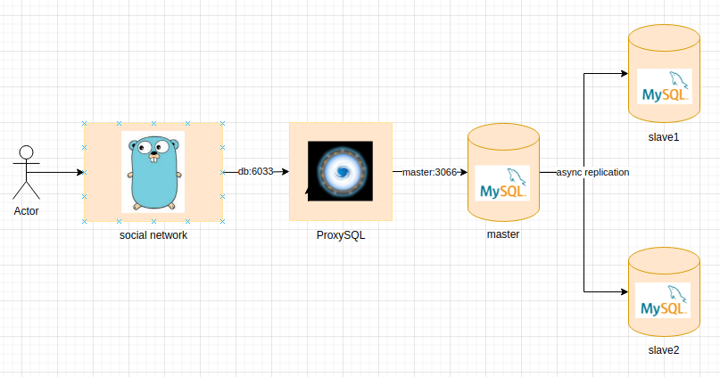

## Репликация

### Настройка асинхронной репликации.

Подготовим конфигурационные файлы для [мастера](async/master/my.conf), [первого](async/slave1.conf) и [второго](async/slave2.conf) слейвов.

Далее запустим экземпляры СУБД

```
docker-compose -f replication/async/docker-compose.yaml up -d
```

Зайдем в мастер контейнер

```
docker exec -it social-db bash
mysql -uroot -ppassword -hmaster
```

Создаем пользователя для репликации и выдаем ему права

```
create user 'replica'@'%' IDENTIFIED BY 'secret';
grant replication slave on *.* to 'replica'@'%';
```

Далее определим *MASTER_LOG_POS*

```
show master status;
```

Получаем результат

```
+---------------+----------+--------------+------------------+-------------------+
| File          | Position | Binlog_Do_DB | Binlog_Ignore_DB | Executed_Gtid_Set |
+---------------+----------+--------------+------------------+-------------------+
| binlog.000003 |      675 |              |                  |                   |
+---------------+----------+--------------+------------------+-------------------+
```

Далее идем на первый слейв

```
docker exec -it social-db-slave1 bash
mysql -uroot -ppassword -h127.0.0.1
```

Добавляем информацию о мастере

```
CHANGE MASTER TO
    MASTER_HOST='master',
    MASTER_USER='replica',
    MASTER_PASSWORD='secret',
    MASTER_LOG_FILE='mysql-bin.000003',
    MASTER_LOG_POS=675;
```

Запускаем слейв

```
start slave;
```

Проверим статус слейва

```
show slave status\G;
```

Повторяем шаги для второго слейва.

Теперь создадим таблицы и индексы в мастере
```
create table if not exists profiles (
    id                bigint not null auto_increment primary key,
    username          varchar(30) not null constraint username_empty_field check (username != '') unique,
    password          text not null constraint password_empty_field check (password != ''),
    firstname         varchar(30) not null,
    lastname          varchar(50) not null,
    gender            integer not null,
    interests         text not null,
    city              varchar(50) not null,
    birthdate         date not null
) engine = InnoDB;
create index firstname_lastname_idx on profiles (firstname, lastname) using btree;
create table if not exists followers (
    follower_id     bigint not null,
    user_id         bigint not null,
    is_active       boolean not null,
    created_at      timestamp default current_timestamp(),
    primary key (user_id, follower_id)
) engine = InnoDB;
```

Проверим, что на слейвах появились таблицы

```
show tables;
+---------------------+
| Tables_in_social_db |
+---------------------+
| followers           |
| profiles            |
+---------------------+
```

Теперь загрузим данные профайлов. После выгрузки вспоминаем, что лучше бы сначала импортировать данные, а уже потом создавать индексы.

```
load data infile '/out.csv' into table profiles fields terminated by ',' ignore 1 lines;
```

Проверяем, что данные доехали на слейвы

```
select count(*) from profiles;
+----------+
| count(*) |
+----------+
|  1000000 |
+----------+
```

### Добавим ProxySQL

Проверим, что ProxySQL прочитал [конфиг](./proxysql.cnf) и добавил сервера и пользователей.
```
select * from mysql_servers;
+--------------+----------+------+-----------+--------+--------+-------------+-----------------+---------------------+---------+----------------+---------+
| hostgroup_id | hostname | port | gtid_port | status | weight | compression | max_connections | max_replication_lag | use_ssl | max_latency_ms | comment |
+--------------+----------+------+-----------+--------+--------+-------------+-----------------+---------------------+---------+----------------+---------+
| 0            | master   | 3306 | 0         | ONLINE | 1      | 0           | 200             | 0                   | 0       | 0              |         |
| 2            | slave1   | 3306 | 0         | ONLINE | 1      | 0           | 200             | 0                   | 0       | 0              |         |
| 2            | slave2   | 3306 | 0         | ONLINE | 1      | 0           | 200             | 0                   | 0       | 0              |         |
+--------------+----------+------+-----------+--------+--------+-------------+-----------------+---------------------+---------+----------------+---------+

select * from mysql_users;
+----------+----------+--------+---------+-------------------+----------------+---------------+------------------------+--------------+---------+----------+-----------------+---------+
| username | password | active | use_ssl | default_hostgroup | default_schema | schema_locked | transaction_persistent | fast_forward | backend | frontend | max_connections | comment |
+----------+----------+--------+---------+-------------------+----------------+---------------+------------------------+--------------+---------+----------+-----------------+---------+
| root     | password | 1      | 0       | 0                 | social_db      | 0             | 1                      | 0            | 1       | 1        | 1000            |         |
| user     | password | 1      | 0       | 0                 | social_db      | 0             | 0                      | 0            | 1       | 1        | 1000            |         |
+----------+----------+--------+---------+-------------------+----------------+---------------+------------------------+--------------+---------+----------+-----------------+---------+
```

Далее добавим правило направляющее весь трафик на мастер

```
insert into mysql_query_rules (active, match_pattern, destination_hostgroup, cache_ttl, username) values (1, '^.*$', 0, NULL, 'user');
LOAD MYSQL QUERY RULES TO RUNTIME;
SAVE MYSQL QUERY RULES TO DISK;
```

Проверим работоспособность конфигурации.

```
SELECT hostgroup_id,hostname,port,status FROM runtime_mysql_servers;
+--------------+----------+------+--------+
| hostgroup_id | hostname | port | status |
+--------------+----------+------+--------+
| 0            | master   | 3306 | ONLINE |
| 2            | slave2   | 3306 | ONLINE |
| 2            | slave1   | 3306 | ONLINE |
+--------------+----------+------+--------+
```

Далее выполним запрос к БД через frontend ProxySQL

```
mysql -uuser -ppassword -h0.0.0.0 -P6033 -D social_db

select * from profiles limit 5;

+----+-----------------+-----------------+-----------+-----------+--------+-------------+----------------+------------+
| id | username        | password        | firstname | lastname  | gender | interests   | city           | birthdate  |
+----+-----------------+-----------------+-----------+-----------+--------+-------------+----------------+------------+
|  1 | Mac.Turner      | BNC2JXCAKVlsc1P | Lawson    | Wilkinson |      1 | programming | Lehi           | 1990-09-09 |
|  2 | Lolita.Johnston | 62OfLiDAXWWV2Oo | Amanda    | Robel     |      1 | programming | Highland       | 1990-09-09 |
|  3 | Lacy25          | CIsBlFAjh4UZmjr | Priscilla | Kerluke   |      1 | programming | Bethesda       | 1990-09-09 |
|  4 | Demarcus.Yost   | 1ocY7TTyHIXmbF_ | Bertha    | Emmerich  |      1 | programming | Danville       | 1990-09-09 |
|  5 | Pearlie46       | imRod7BYE7JvKCO | Aida      | Cremin    |      1 | programming | Citrus Heights | 1990-09-09 |
+----+-----------------+-----------------+-----------+-----------+--------+-------------+----------------+------------+
```

Схема стенда перед первым прогоном нагрузочных тестов.



## Нагрузочное тестирование (весь трафик на master)

```
wrk -t100 -c100 -d30s --timeout 90s -s ../indexes/generator.lua --latency http://localhost:8080

Running 30s test @ http://localhost:8080
  100 threads and 100 connections
  Thread Stats   Avg      Stdev     Max   +/- Stdev
    Latency    11.51ms    7.28ms  98.75ms   79.83%
    Req/Sec    91.92     20.91   300.00     67.47%
  Latency Distribution
     50%    9.62ms
     75%   14.35ms
     90%   20.69ms
     99%   37.66ms
  275795 requests in 30.10s, 44.95MB read
Requests/sec:   9162.65
Transfer/sec:      1.49MB
```

```
docker stats -a

CONTAINER ID   NAME                    CPU %     MEM USAGE / LIMIT     MEM %     NET I/O           BLOCK I/O         PIDS
b6c97d6b9b32   social-db-slave1        0.12%     526MiB / 15.58GiB     3.30%     86.4MB / 180kB    18.2MB / 1.43GB   43
be2e7db7d4a5   social-db               125.88%   961.8MiB / 15.58GiB   6.03%     137MB / 651MB     9MB / 1.39GB      60
cd3ddbdde6e5   proxysql                80.25%    12.51MiB / 15.58GiB   0.08%     1.13GB / 1.86GB   4.1kB / 463kB     19
6ca456334067   social-db-slave2        0.12%     515MiB / 15.58GiB     3.23%     86.4MB / 130kB    8.99MB / 1.43GB   42
...
```
Видно, что потребление CPU мастер ноды составляет ~125%, также нагружен proxysql.

## Нагрузочное тестирование (чтение анкет с реплик)

Добавим соответствующие правила в ProxySQL

```
insert into mysql_query_rules (active, match_pattern, destination_hostgroup, cache_ttl, username) values (1, '^select .* from profiles where (firstname like .*$', 2, NULL, 'user');
insert into mysql_query_rules (active, match_pattern, destination_hostgroup, cache_ttl, username) values (1, '^select .* from profiles where id = .*$', 2, NULL, 'user');
LOAD MYSQL QUERY RULES TO RUNTIME;
SAVE MYSQL QUERY RULES TO DISK;
```

Даем нагрузку

```
wrk -t100 -c100 -d30s --timeout 90s -s ../indexes/generator.lua --latency http://localhost:8080

Running 30s test @ http://localhost:8080
  100 threads and 1000 connections
  Thread Stats   Avg      Stdev     Max   +/- Stdev
    Latency   176.14ms  276.89ms   5.02s    89.77%
    Req/Sec   101.24     40.21     1.39k    71.25%
  Latency Distribution
     50%   73.06ms
     75%  185.69ms
     90%  462.06ms
     99%    1.40s 
  282218 requests in 30.10s, 45.84MB read
  Socket errors: connect 79, read 0, write 0, timeout 0
Requests/sec:   9376.50
Transfer/sec:      1.52MB
```

```
CONTAINER ID   NAME                    CPU %     MEM USAGE / LIMIT     MEM %     NET I/O           BLOCK I/O         PIDS
b6c97d6b9b32   social-db-slave1        60.88%    547.2MiB / 15.58GiB   3.43%     94.1MB / 27.3MB   18.3MB / 1.43GB   50
be2e7db7d4a5   social-db               0.13%     1.074GiB / 15.58GiB   6.90%     195MB / 857MB     9MB / 1.39GB      60
cd3ddbdde6e5   proxysql                81.45%    13.81MiB / 15.58GiB   0.09%     1.74GB / 2.87GB   4.1kB / 643kB     19
6ca456334067   social-db-slave2        61.28%    536.7MiB / 15.58GiB   3.36%     94.2MB / 27.4MB   9.04MB / 1.43GB   50
```

### Настройка полу синхронной репликации.

## Включаем row-based репликацию и gtid

Обновляем конфигурационный файл my.cnf на всех узлах БД и рестартуем контейнеры.
```
[mysqld]
...
binlog_format    = ROW
gtid_mode = on
enforce_gtid_consistency = true
...
```

Проверяем конфигурацию на всех узлах
```
show variables like 'binlog_format';

+---------------+-------+
| Variable_name | Value |
+---------------+-------+
| binlog_format | ROW   |
+---------------+-------+

show variables like 'gtid_mode';

+---------------+-------+
| Variable_name | Value |
+---------------+-------+
| gtid_mode     | ON    |
+---------------+-------+
```

Далее на каждом слейве включаем автопозиционирование.
```
stop slave;
change master to MASTER_AUTO_POSITION = 1;
start slave;
```

### Настраиваем полу синхронную репликацию на master.

Выполняем команду
```
install plugin rpl_semi_sync_master soname 'semisync_master.so';

select plugin_name, plugin_status from information_schema.plugins where plugin_name like '%semi%';
+----------------------+---------------+
| PLUGIN_NAME          | PLUGIN_STATUS |
+----------------------+---------------+
| rpl_semi_sync_master | ACTIVE        |
+----------------------+---------------+
```

Обновляем конфигурацию `my.conf`

```
[mysqld]
...
rpl_semi_sync_master_enabled = 1
rpl_semi_sync_master_timeout = 400
...
```

Рестартуем контейнер

### Настраиваем полу синхронную репликацию на slaves.

Выполняем команду
```
install plugin rpl_semi_sync_slave soname 'semisync_slave.so';

select plugin_name, plugin_status from information_schema.plugins where plugin_name like '%semi%';
+---------------------+---------------+
| plugin_name         | plugin_status |
+---------------------+---------------+
| rpl_semi_sync_slave | ACTIVE        |
+---------------------+---------------+
```

Обновляем конфиг и рестартуем слейвы

```
[mysqld]
...
rpl_semi_sync_master_enabled = 1
...
```

## Нагрузка на запись

Запускаем нагрузку на запись, ждем 10-15 секунд и убиваем мастер

```
wrk -t100 -c100 -d30s --timeout 90s -s ./replication/write_generator.lua --latency http://localhost:8080
```

После завершения теста проверяем переменную gtid на слейвах

Слейв 1
```
show variables like 'gtid_executed';
+---------------+--------------------------------------------+
| Variable_name | Value                                      |
+---------------+--------------------------------------------+
| gtid_executed | 0f031b2e-3fb7-11ec-a1e2-0242c0a87003:1-166 |
+---------------+--------------------------------------------+
```

Cлейв 2
```
show variables like 'gtid_executed';

+---------------+--------------------------------------------+
| Variable_name | Value                                      |
+---------------+--------------------------------------------+
| gtid_executed | 1033e597-3fb7-11ec-a07b-0242c0a87005:1-166 |
+---------------+--------------------------------------------+
```

Поднимем мастер, чтобы оценить количество потерянных записей

```
select count(*) from followers;
+----------+
| count(*) |
+----------+
|      166 |
+----------+
```

Можно сделать вывод, что в результате аварии потери записей не произошло.

Убьем мастер и сделаем новым мастером первый слейв.

```
docker kill social_db
docker exec -it social-db-slave1 bash
mysql -uroot -ppassword -hslave1
show slave status\G

...
Last_IO_Error: error reconnecting to master 'replica@master:3306' - retry-time: 60 retries: 2 message: Unknown MySQL server host 'master' (11)
...
stop slave;
create user 'replica'@'%' IDENTIFIED BY 'slave_secret';
grant replication slave on *.* TO 'replica'@'%';
reset master;
```

Далее во втором слейве

```
stop slave;
change master to MASTER_HOST='slave1', MASTER_PASSWORD='slave_secret';
start slave;
show slave status\G

*************************** 1. row ***************************
               Slave_IO_State: Waiting for source to send event
                  Master_Host: slave1
                  Master_User: replica
                  Master_Port: 3306
                Connect_Retry: 60
              Master_Log_File: mysql-bin.000001
          Read_Master_Log_Pos: 156
               Relay_Log_File: 6ca456334067-relay-bin.000002
...
```